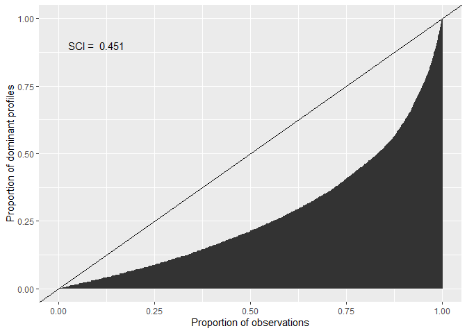

# `cacc`: Conjunctive Analysis of Case Configurations

<!-- badges: start -->

[](https://lifecycle.r-lib.org/articles/stages.html#experimental)
<!-- badges: end -->

An R Package to compute Conjunctive Analysis of Case Configurations
(CACC), Situational Clustering Tests, and Main Effects

## Overview

This package contains a set of functions to conduct Conjunctive Analysis
of Case Configurations (CACC) (Miethe, Hart & Regoeczi, 2008), to
identify and quantify situational clustering in dominant case
configurations (Hart, 2019), and to determine the main effects of
specific variable values on the probabilities of outcome (Hart, Rennison
& Miethe, 2017). Initially conceived as an exploratory technique for
multivariate analysis of categorical data, CACC has developed to include
formal statistical tests that can be applied in a wide variety of
contexts. This technique allows examining composite profiles of
different units of analysis in an alternative way to variable-oriented
methods.

## Installation

You can install the development version of cacc from
[GitHub](https://github.com/) with:

``` r
# Check if the`devtools` package needs to be installed
if (!require("devtools")) install.package("devtools")

# Install the {cacc} package from GitHub
devtools::install_github("amoneva/cacc")
```

## Examples

``` r
# Load {cacc} and the {tidyverse}
library(cacc)
library(tidyverse)
#> ── Attaching packages ─────────────────────────────────────── tidyverse 1.3.2 ──
#> ✔ ggplot2 3.3.6     ✔ purrr   0.3.4
#> ✔ tibble  3.1.8     ✔ dplyr   1.0.9
#> ✔ tidyr   1.2.0     ✔ stringr 1.4.1
#> ✔ readr   2.1.2     ✔ forcats 0.5.2
#> ── Conflicts ────────────────────────────────────────── tidyverse_conflicts() ──
#> ✖ dplyr::filter() masks stats::filter()
#> ✖ dplyr::lag()    masks stats::lag()
```

``` r
# Explore the dataset
onharassment |> glimpse()
#> Rows: 4,174
#> Columns: 12
#> $ sex          <fct> male, male, male, female, female, female, male, female, m…
#> $ age          <fct> 15-17, 18-21, 18-21, 18-21, 18-21, 15-17, 12-14, 12-14, 1…
#> $ hours        <fct> 4-7, 4-7, 4-7, 4-7, 4-7, 4-7, <4, 4-7, 4-7, 4-7, <4, <4, …
#> $ snapchat     <fct> yes, no, no, yes, no, yes, yes, yes, no, no, no, no, no, …
#> $ instagram    <fct> yes, yes, yes, yes, yes, yes, yes, yes, yes, yes, no, yes…
#> $ facebook     <fct> no, no, no, yes, no, no, no, no, no, no, no, no, no, no, …
#> $ twitter      <fct> yes, yes, no, yes, no, no, no, no, no, yes, no, no, no, n…
#> $ name         <fct> no, yes, no, no, yes, yes, yes, yes, yes, yes, no, yes, n…
#> $ photos       <fct> no, no, no, no, no, yes, yes, yes, yes, yes, no, no, no, …
#> $ privacy      <fct> no, no, no, no, no, no, no, no, no, no, no, no, no, no, n…
#> $ rep_victim   <fct> 0, 0, 1, 1, 0, 1, 0, 1, 1, 0, 1, 0, 0, 0, 1, 1, 1, 0, 1, …
#> $ rep_offender <fct> 0, 0, 0, 0, 0, 1, 0, 0, 1, 0, 0, 0, 0, 0, 1, 1, 1, 0, 0, …
```

### CACC

``` r
# Calculate the CACC matrix
cacc_matrix <- onharassment |> 
  cacc(
    ivs = sex:privacy, 
    dv = rep_victim
  )
#> Joining, by = c("sex", "age", "hours", "snapchat", "instagram", "facebook",
#> "twitter", "name", "photos", "privacy")

# Look at the first few rows
cacc_matrix |> head()
#> # A tibble: 6 × 12
#>   sex    age   hours snapchat insta…¹ faceb…² twitter name  photos privacy  freq
#>   <fct>  <fct> <fct> <fct>    <fct>   <fct>   <fct>   <fct> <fct>  <fct>   <int>
#> 1 female 15-17 4-7   yes      yes     no      no      yes   yes    no         11
#> 2 female 12-14 <4    no       yes     no      no      yes   yes    yes        10
#> 3 female 15-17 4-7   no       yes     no      no      yes   yes    no         16
#> 4 female 15-17 4-7   no       yes     no      yes     yes   no     no         10
#> 5 female 18-21 4-7   no       yes     no      no      no    no     yes        10
#> 6 female 18-21 4-7   no       yes     yes     yes     no    no     yes        10
#> # … with 1 more variable: p <dbl>, and abbreviated variable names ¹​instagram,
#> #   ²​facebook
```

### Situational Clustering Tests

``` r
# Compute a Chi-Square Goodness-of-Fit Test
cacc_matrix |> cluster_xsq()
#> 
#>  Chi-squared test for given probabilities
#> 
#> data:  obs
#> X-squared = 3378.2, df = 93, p-value < 2.2e-16
```

``` r
# Compute a Situational Clustering Index (SCI)
cacc_matrix |> cluster_sci()
#> [1] 0.4505963

# Plot a Lorenz Curve to visualize the SCI
cacc_matrix |> plot_sci()
```



### Main Effects

``` r
# Compute the main effects for a specific variable value
cacc_matrix |> 
  main_effect(
    iv = sex,
    value = "female",
    # Set to `FALSE` for a numeric vector of effects
    summary = TRUE
  )
#> # A tibble: 1 × 5
#>   median  mean    sd    min   max
#>    <dbl> <dbl> <dbl>  <dbl> <dbl>
#> 1  0.037 0.041 0.117 -0.188 0.278

# Plot the distribution of the main effect
cacc_matrix |> 
  plot_effect(
    iv = sex,
    value = "female"
  )
```


## References

-   Hart, T. C. (2019). Identifying Situational Clustering and
    Quantifying Its Magnitude in Dominant Case Configurations: New
    Methods for Conjunctive Analysis. *Crime & Delinquency, 66*(1),
    143-159. <https://doi.org/10.1177/0011128719866123>
-   Hart, T. C., Rennison, C. M., & Miethe, T. D. (2017). Identifying
    Patterns of Situational Clustering and Contextual Variability in
    Criminological Data: An Overview of Conjunctive Analysis of Case
    Configurations. *Journal of Contemporary Criminal Justice, 33*(2),
    112–120. <https://doi.org/10.1177/1043986216689746>
-   Miethe, T. D., Hart, T. C., & Regoeczi, W. C. (2008). The
    Conjunctive Analysis of Case Configurations: An Exploratory Method
    for Discrete Multivariate Analyses of Crime Data. *Journal of
    Quantitative Criminology, 24*, 227–241.
    <https://doi.org/10.1007/s10940-008-9044-8>
